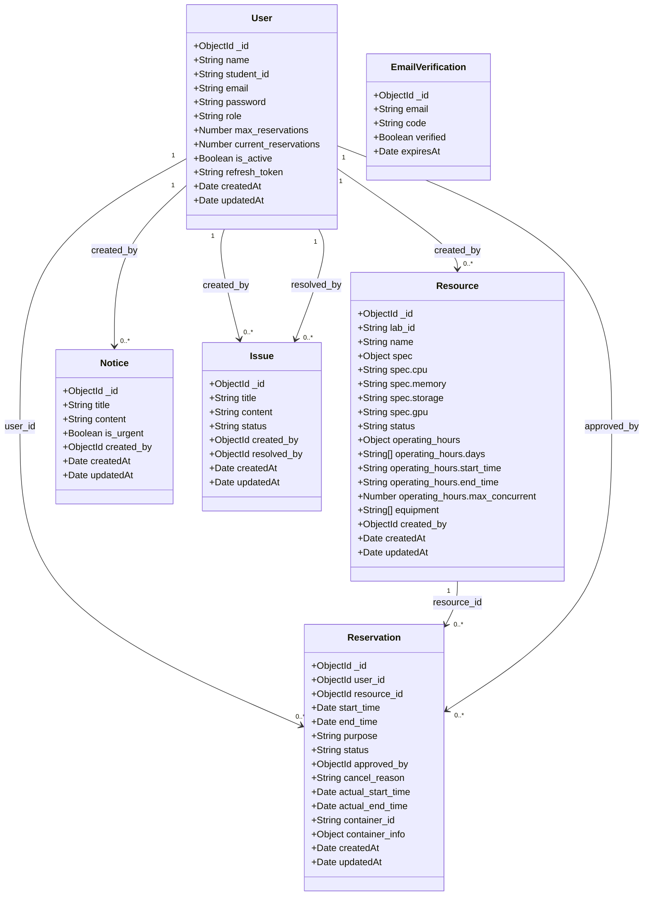

# 클라우드 기반 학과 가상 실습실 예약 및 제어 센터 — 1조 최종 보고서


---

## 1. 실험의 목적과 범위

### 1-1. 목적

학과에서 운영하는 공용 서버 및 고사양 PC 자원을 학생들이 효율적으로 예약하고 사용할 수 있도록, 웹 기반 예약 및 제어 시스템을 설계·구현한다. 관리자는 자원 상태를 실시간으로 모니터링하고, 컨테이너 기반 실습 환경을 동적으로 생성·종료할 수 있다.

### 1-2. 포함 범위

| 구분 | 내용 |
|------|------|
| 인증 | 이메일 인증 기반 회원가입, JWT 토큰 로그인/갱신/로그아웃 |
| 예약 | 자원 예약 신청, 충돌 방지 알고리즘, 상태 관리(승인/거절/강제 회수) |
| 자원 관리 | 실습 자원 CRUD, 운영 시간 설정, 상태(active/maintenance/retired) 관리 |
| 사용자 관리 | 전체 사용자 조회, 이용정지/복구 |
| 공지사항 | 관리자 등록, 학생 조회, 긴급 공지 |
| 이슈 관리 | 학생 이슈 등록, 관리자 상태 처리(waiting/in_progress/resolved) |
| Docker 제어 | 컨테이너 프리셋 기반 생성/종료 |
| 모니터링 | Grafana/Prometheus 기반 서버 상태 시각화 |

### 1-3. 미포함 범위

- 실시간 알림(웹소켓) 기능은 구현 완료 후 통합 예정
- 모바일 앱은 지원하지 않으며 웹 브라우저 기반으로만 동작

---

## 2. 분석 — 기능 목록 (유스케이스)

### 2-1. 액터 정의

| 액터 | 설명 | 주요 기능 |
|------|------|-----------|
| **학생** | 학과 학생 (일반 사용자) | 회원가입, 로그인, 예약 신청/취소, 공지 조회, 이슈 등록 |
| **관리자** | 시스템 관리자 | 예약 승인/거절, 자원 관리, 사용자 관리, 컨테이너 제어, 공지/이슈 관리 |

---

### 2-2. 유스케이스 목록

| UC-ID | 유스케이스명 | 액터 | 관련 API |
|-------|------------|------|---------|
| UC-01 | 회원가입 | 비로그인 사용자 | `POST /api/auth/register` |
| UC-02 | 로그인 | 학생, 관리자 | `POST /api/auth/login` |
| UC-03 | 예약 신청 | 학생 | `POST /api/reservations`, `GET /api/resources` |
| UC-04 | 내 예약 현황 조회 | 학생 | `GET /api/reservations/me` |
| UC-05 | 예약 취소 | 학생 | `PATCH /api/reservations/:id/cancel` |
| UC-06 | 실제 사용 시작 / 종료 | 학생 | `PATCH /api/reservations/:id/start`, `PATCH /api/reservations/:id/end` |
| UC-07 | 공지사항 조회 | 학생, 관리자 | `GET /api/notices`, `GET /api/notices/:id` |
| UC-08 | 이슈 등록 및 조회 | 학생 | `POST /api/issues`, `GET /api/issues/me` |
| UC-09 | 예약 승인 / 거절 | 관리자 | `PATCH /api/reservations/:id/approve`, `PATCH /api/reservations/:id/reject` |
| UC-10 | 사용자 이용정지 / 복구 | 관리자 | `GET /api/users`, `PATCH /api/users/:id` |
| UC-11 | 자원 관리 | 관리자 | `GET /api/resources`, `POST /api/resources`, `PATCH /api/resources/:id/status` |
| UC-12 | 공지사항 등록 / 수정 / 삭제 | 관리자 | `POST /api/notices`, `PATCH /api/notices/:id`, `DELETE /api/notices/:id` |
| UC-13 | 이슈 상태 변경 및 삭제 | 관리자 | `PATCH /api/issues/:id/status`, `DELETE /api/issues/:id` |
| UC-14 | 컨테이너 생성 및 종료 | 관리자 | `GET /api/containers/presets`, `GET /api/containers`, `POST /api/containers/run/:presetName`, `POST /api/containers/kill/:id` |

---

### 2-3. 유스케이스 상세 명세

#### UC-01: 회원가입

| 항목 | 내용 |
|------|------|
| **액터** | 비로그인 사용자 |
| **개요** | 학생이 이름, 학번, 이메일, 비밀번호를 입력하여 계정을 생성한다. |
| **사전 조건** | 사용자가 로그인되어 있지 않은 상태 |
| **사후 조건** | 새 계정이 DB에 저장되며 로그인 페이지로 이동한다. |
| **기본 흐름** | 1. 회원가입 페이지 접속 → 2. 이름, 학번, 이메일, 비밀번호 입력 → 3. 시스템이 입력값 검증 후 계정 생성 → 4. 로그인 페이지로 이동 |
| **예외 흐름** | 이미 등록된 학번/이메일 → 중복 오류 / 필수 항목 미입력 → 입력 요청 |
| **관련 API** | `POST /api/auth/register` |

#### UC-02: 로그인

| 항목 | 내용 |
|------|------|
| **액터** | 학생, 관리자 |
| **개요** | 학번과 비밀번호를 입력하여 시스템에 로그인한다. |
| **사전 조건** | 사용자가 로그인되어 있지 않은 상태 |
| **사후 조건** | AccessToken과 RefreshToken이 발급되며 대시보드로 이동한다. |
| **기본 흐름** | 1. 로그인 페이지 접속 → 2. 학번, 비밀번호 입력 → 3. 시스템이 자격증명 검증 후 토큰 발급 → 4. 역할에 따라 대시보드로 이동 |
| **예외 흐름** | 학번/비밀번호 불일치 → 오류 메시지 / 비활성화 계정 → 이용정지 안내 |
| **관련 API** | `POST /api/auth/login` |

#### UC-03: 예약 신청

| 항목 | 내용 |
|------|------|
| **액터** | 학생 |
| **개요** | 학생이 사용할 자원과 날짜, 시간, 목적을 선택하여 예약을 신청한다. |
| **사전 조건** | 학생이 로그인된 상태이며 예약 가능 횟수가 남아있는 상태 |
| **사후 조건** | 예약이 `waiting` 상태로 DB에 저장되고 관리자 승인을 대기한다. |
| **기본 흐름** | 1. 예약 신청 페이지 접속 → 2. 자원 선택 → 3. 날짜/시간 선택 → 4. 사용 목적 입력 → 5. 충돌 방지 알고리즘 유효성 검사 → 6. `waiting` 상태로 예약 생성 |
| **예외 흐름** | 운영일(월~금) 외 → 오류 / 운영시간(09:00~22:00) 외 → 오류 / 동일 시간대 초과 → 409 / 예약 횟수 초과 → 오류 |
| **관련 API** | `POST /api/reservations`, `GET /api/resources` |

#### UC-04: 내 예약 현황 조회

| 항목 | 내용 |
|------|------|
| **액터** | 학생 |
| **개요** | 학생이 본인의 예약 목록을 조회하고 상태를 확인한다. |
| **사전 조건** | 학생이 로그인된 상태 |
| **사후 조건** | 예약 목록이 표시되며, 만료된 예약은 자동으로 `completed` 처리된다. |
| **기본 흐름** | 1. 내 예약 현황 페이지 접속 → 2. 만료 예약 자동 completed 처리 → 3. 전체 예약 목록 최신순 표시 |
| **예외 흐름** | 예약 내역 없음 → 빈 목록 안내 |
| **관련 API** | `GET /api/reservations/me` |

#### UC-05: 예약 취소

| 항목 | 내용 |
|------|------|
| **액터** | 학생 |
| **개요** | 학생이 본인의 예약을 취소한다. |
| **사전 조건** | 학생이 로그인된 상태이며 취소 가능한 예약이 존재 |
| **사후 조건** | 예약 상태가 `cancelled`로 변경되고 예약 가능 횟수가 1 복구된다. |
| **기본 흐름** | 1. 내 예약 현황에서 취소할 예약 선택 → 2. 취소 버튼 클릭 → 3. 취소 가능 여부 검증 → 4. 상태 `cancelled`로 변경 |
| **예외 흐름** | 이미 취소/완료된 예약 → 오류 / 본인 예약 아닌 경우 → 403 |
| **관련 API** | `PATCH /api/reservations/:id/cancel` |

#### UC-06: 실제 사용 시작 / 종료

| 항목 | 내용 |
|------|------|
| **액터** | 학생 |
| **개요** | 학생이 승인된 예약의 실제 사용을 시작하고 종료한다. |
| **사전 조건** | 학생이 로그인된 상태이며 `reserved` 상태의 예약이 존재 |
| **사후 조건** | 사용 시작: `using`으로 변경 / 사용 종료: `completed`로 변경 |
| **기본 흐름** | 1. 사용 시작 클릭 → `actual_start_time` 기록, 상태 `using` → 2. 사용 종료 클릭 → `actual_end_time` 기록, 상태 `completed` |
| **예외 흐름** | `reserved` 아닌 예약에 시작 시도 → 오류 / `using` 아닌 예약에 종료 시도 → 오류 |
| **관련 API** | `PATCH /api/reservations/:id/start`, `PATCH /api/reservations/:id/end` |

#### UC-07: 공지사항 조회

| 항목 | 내용 |
|------|------|
| **액터** | 학생, 관리자 |
| **개요** | 사용자가 공지사항 목록 및 상세 내용을 조회한다. |
| **사전 조건** | 사용자가 로그인된 상태 |
| **사후 조건** | 공지사항 목록 또는 상세 내용이 화면에 표시된다. |
| **기본 흐름** | 1. 공지사항 페이지 접속 → 2. 최신순 목록 표시 (긴급 공지 상단 강조) → 3. 클릭 시 상세 내용 확인 |
| **예외 흐름** | 공지사항 없음 → 빈 목록 안내 |
| **관련 API** | `GET /api/notices`, `GET /api/notices/:id` |

#### UC-08: 이슈 등록 및 조회

| 항목 | 내용 |
|------|------|
| **액터** | 학생 |
| **개요** | 학생이 장비 문제나 불편사항을 이슈로 등록하고 처리 현황을 확인한다. |
| **사전 조건** | 학생이 로그인된 상태 |
| **사후 조건** | 이슈가 `waiting` 상태로 DB에 저장되고 목록에 표시된다. |
| **기본 흐름** | 1. 이슈 관리 페이지 접속 → 2. 제목, 내용 입력 후 등록 → 3. 내 이슈 목록에서 처리 상태 확인 |
| **예외 흐름** | 제목/내용 미입력 → 입력 요청 |
| **관련 API** | `POST /api/issues`, `GET /api/issues/me` |

#### UC-09: 예약 승인 / 거절

| 항목 | 내용 |
|------|------|
| **액터** | 관리자 |
| **개요** | 관리자가 학생의 예약 신청을 승인하거나 거절한다. |
| **사전 조건** | 관리자가 로그인된 상태이며 `waiting` 상태의 예약이 존재 |
| **사후 조건** | 승인: `reserved`로 변경 / 거절: 취소 사유와 함께 `cancelled`로 변경 |
| **기본 흐름** | 1. 예약 관리 페이지 접속 → 2. 대기 중 예약 목록 확인 → 3. 승인/거절 처리 |
| **예외 흐름** | `waiting` 아닌 예약에 승인/거절 시도 → 오류 |
| **관련 API** | `PATCH /api/reservations/:id/approve`, `PATCH /api/reservations/:id/reject` |

#### UC-10: 사용자 이용정지 / 복구

| 항목 | 내용 |
|------|------|
| **액터** | 관리자 |
| **개요** | 관리자가 특정 학생의 계정을 이용정지하거나 복구한다. |
| **사전 조건** | 관리자가 로그인된 상태 |
| **사후 조건** | 사용자 계정의 `is_active` 상태가 변경된다. |
| **기본 흐름** | 1. 사용자 관리 페이지 접속 → 2. 학생 목록 확인 → 3. 이용정지: `is_active = false` / 복구: `is_active = true` |
| **예외 흐름** | 존재하지 않는 사용자 → 404 |
| **관련 API** | `GET /api/users`, `PATCH /api/users/:id` |

#### UC-11: 자원 관리

| 항목 | 내용 |
|------|------|
| **액터** | 관리자 |
| **개요** | 관리자가 실습 자원을 등록, 수정하고 상태를 관리한다. |
| **사전 조건** | 관리자가 로그인된 상태 |
| **사후 조건** | 자원 정보가 DB에 저장되거나 상태가 변경된다. |
| **기본 흐름** | 1. 자원 관리 페이지 접속 → 2. 자원 등록(정보 입력 후 저장) → 3. 기존 자원 상태 변경(`active` / `maintenance` / `retired`) |
| **예외 흐름** | 필수 항목 미입력 → 입력 요청 |
| **관련 API** | `GET /api/resources`, `POST /api/resources`, `PATCH /api/resources/:id/status` |

#### UC-12: 공지사항 등록 / 수정 / 삭제

| 항목 | 내용 |
|------|------|
| **액터** | 관리자 |
| **개요** | 관리자가 공지사항을 등록, 수정, 삭제한다. |
| **사전 조건** | 관리자가 로그인된 상태 |
| **사후 조건** | 공지사항이 DB에 저장, 수정, 또는 삭제된다. |
| **기본 흐름** | 1. 공지사항 관리 페이지 접속 → 2. 등록: 제목, 내용, 긴급 여부 입력 → 3. 수정/삭제: 기존 공지사항 선택 후 처리 |
| **예외 흐름** | 제목/내용 미입력 → 입력 요청 / 존재하지 않는 공지사항 → 404 |
| **관련 API** | `POST /api/notices`, `PATCH /api/notices/:id`, `DELETE /api/notices/:id` |

#### UC-13: 이슈 상태 변경 및 삭제

| 항목 | 내용 |
|------|------|
| **액터** | 관리자 |
| **개요** | 관리자가 등록된 이슈의 처리 상태를 변경하고 완료된 이슈를 삭제한다. |
| **사전 조건** | 관리자가 로그인된 상태 |
| **사후 조건** | 이슈 상태가 변경되거나 삭제된다. |
| **기본 흐름** | 1. 이슈 관리 페이지 접속 → 2. 처리 시작: `waiting → in_progress` → 3. 처리 완료: `in_progress → resolved` → 4. 필요 시 삭제 |
| **예외 흐름** | 유효하지 않은 상태값 → 오류 / 존재하지 않는 이슈 → 404 |
| **관련 API** | `PATCH /api/issues/:id/status`, `DELETE /api/issues/:id` |

#### UC-14: 컨테이너 생성 및 종료

| 항목 | 내용 |
|------|------|
| **액터** | 관리자 |
| **개요** | 관리자가 Docker 컨테이너를 프리셋 기반으로 생성하고 종료한다. |
| **사전 조건** | 관리자가 로그인된 상태이며 Docker 환경이 구성된 상태 |
| **사후 조건** | 컨테이너가 생성되어 실행 중이거나, 종료 및 삭제된다. |
| **기본 흐름** | 1. Docker 제어 페이지 접속 → 2. 프리셋 목록 조회 → 3. 프리셋 선택 후 컨테이너 생성 → 4. 실행 중 컨테이너 선택 후 종료(stop & remove) |
| **예외 흐름** | 존재하지 않는 프리셋 → 오류 / Docker 미실행 환경 → 안내 메시지 |
| **관련 API** | `GET /api/containers/presets`, `GET /api/containers`, `POST /api/containers/run/:presetName`, `POST /api/containers/kill/:id` |

---

### 2-4. 예약 상태 전이

| 상태값 | 의미 | 전환 조건 |
|--------|------|-----------|
| `waiting` | 승인 대기 중 | 예약 신청 직후 기본값 |
| `reserved` | 예약됨 | 관리자가 승인했을 때 |
| `using` | 사용 중 | 학생이 사용 시작 버튼 클릭 시 |
| `completed` | 완료 | 사용 종료 클릭 또는 `end_time` 경과 시 자동 처리 |
| `cancelled` | 취소됨 | 학생이 직접 취소하거나 관리자가 거절했을 때 |

### 2-5. 이슈 상태 전이

| 상태값 | 의미 | 전환 조건 |
|--------|------|-----------|
| `waiting` | 접수 대기 중 | 이슈 등록 직후 기본값 |
| `in_progress` | 처리 중 | 관리자가 처리 시작으로 변경했을 때 |
| `resolved` | 처리 완료 | 관리자가 처리 완료로 변경했을 때 |

## 3. 설계

### 3-1. 시스템 아키텍처

```
[프론트엔드 : React + Vite]
        ↕ HTTP REST API (axios)
[백엔드 : Node.js + Express]
        ↕ Mongoose ODM
[데이터베이스 : MongoDB Atlas]

[Docker API (dockerode)]
        ↕
[Docker Engine (EC2)]
        ↕
[Prometheus + Grafana (모니터링)]
```

### 3-2. 클래스 다이어그램 (MongoDB 스키마)

#### User

| 필드 | 타입 | 설명 |
|------|------|------|
| _id | ObjectId | 기본 키 |
| name | String | 이름 |
| student_id | String | 학번 (unique) |
| email | String | 이메일 |
| password | String | bcrypt 해시 비밀번호 |
| role | String | student \| admin |
| max_reservations | Number | 최대 예약 횟수 (기본: 3) |
| current_reservations | Number | 현재 예약 수 (기본: 0) |
| is_active | Boolean | 계정 활성 여부 |
| refresh_token | String | JWT Refresh Token |
| createdAt | Date | 생성일시 |
| updatedAt | Date | 수정일시 |

#### Resource

| 필드 | 타입 | 설명 |
|------|------|------|
| _id | ObjectId | 기본 키 |
| lab_id | String | 실습실 코드 |
| name | String | 자원 이름 |
| spec | Object | 사양 정보 |
| spec.cpu | String | CPU 사양 |
| spec.memory | String | 메모리 사양 |
| spec.storage | String | 스토리지 사양 |
| spec.gpu | String | GPU 사양 |
| status | String | active \| maintenance \| retired |
| operating_hours | Object | 운영 시간 정보 |
| operating_hours.days | String[] | 운영 요일 |
| operating_hours.start_time | String | 운영 시작 시간 |
| operating_hours.end_time | String | 운영 종료 시간 |
| operating_hours.max_concurrent | Number | 최대 동시 예약 수 |
| equipment | String[] | 보유 장비 목록 |
| created_by | ObjectId | 등록 관리자 (ref: User) |
| createdAt | Date | 생성일시 |
| updatedAt | Date | 수정일시 |

#### Reservation

| 필드 | 타입 | 설명 |
|------|------|------|
| _id | ObjectId | 기본 키 |
| user_id | ObjectId | 예약자 (ref: User) |
| resource_id | ObjectId | 예약 자원 (ref: Resource) |
| start_time | Date | 시작 시각 |
| end_time | Date | 종료 시각 |
| purpose | String | 사용 목적 |
| status | String | waiting \| reserved \| using \| completed \| cancelled |
| approved_by | ObjectId | 승인 관리자 (ref: User) |
| cancel_reason | String | 취소/거절 사유 |
| actual_start_time | Date | 실제 사용 시작 시각 |
| actual_end_time | Date | 실제 사용 종료 시각 |
| container_id | String | Docker 컨테이너 ID |
| container_info | Object | Docker 컨테이너 연결 정보 |
| createdAt | Date | 생성일시 |
| updatedAt | Date | 수정일시 |

#### Notice

| 필드 | 타입 | 설명 |
|------|------|------|
| _id | ObjectId | 기본 키 |
| title | String | 제목 |
| content | String | 내용 |
| is_urgent | Boolean | 긴급 공지 여부 |
| created_by | ObjectId | 등록 관리자 (ref: User) |
| createdAt | Date | 생성일시 |
| updatedAt | Date | 수정일시 |

#### Issue

| 필드 | 타입 | 설명 |
|------|------|------|
| _id | ObjectId | 기본 키 |
| title | String | 제목 |
| content | String | 내용 |
| status | String | waiting \| in_progress \| resolved |
| created_by | ObjectId | 등록자 (ref: User) |
| resolved_by | ObjectId | 처리 관리자 (ref: User) |
| createdAt | Date | 생성일시 |
| updatedAt | Date | 수정일시 |

#### EmailVerification

| 필드 | 타입 | 설명 |
|------|------|------|
| _id | ObjectId | 기본 키 |
| email | String | 이메일 |
| code | String | 인증 코드 (6자리) |
| verified | Boolean | 인증 완료 여부 |
| expiresAt | Date | 만료 시각 (TTL 인덱스, 5분 후 자동 삭제) |

#### 클래스 간 관계



### 3-3. 순서도 (Flowchart)

전체 시스템 흐름은 아래와 같다.

1. **로그인** → 인증 성공/실패 분기 → 역할별(학생/관리자) 화면 이동
2. **학생 흐름**: 예약 신청 → 대기 → 관리자 승인 → 예약됨 → 시간 도래 → 사용 시작 → 사용 중 → 사용 완료
3. **관리자 흐름**: 예약 목록 조회 → 승인/거절/강제 회수 + 자원 관리 + 사용자 관리 + 공지/이슈 + Docker/Grafana


### 3-4. 시퀀스 다이어그램

#### 로그인 흐름
```
사용자 → 프론트엔드: 학번, 비밀번호 입력
프론트엔드 → 인증API: POST /api/auth/login
인증API → DB: 사용자 조회
[인증 성공] 비밀번호 검증 → 토큰 생성 → 200 OK (accessToken, refreshToken)
[인증 실패] 401 Unauthorized
```


#### 예약 신청 흐름
```
사용자 → 예약API: POST /api/reservations
예약API → DB: 자원 상태 확인
[자원 불가] 400/404 반환
[자원 가능] 운영시간 확인 → 중복 예약 조회
[중복 존재] 409 Conflict
[예약 가능] 예약 생성 → 201 Created
```


#### 예약 승인/거절 흐름
```
관리자 → 예약API: GET /api/reservations (권한 확인)
[승인] PATCH /api/reservations/:id/approve → status: reserved
[거절] PATCH /api/reservations/:id/reject → status: cancelled + cancel_reason
```


### 3-5. 충돌 방지 알고리즘

예약 신청 시 `validateReservation()` 함수에서 아래 순서로 유효성 검사를 수행한다.

```
1단계: 자원 상태 확인
  - 존재하지 않음 → 404
  - maintenance → 400
  - retired → 400

2단계: 운영 요일/시간 확인
  - 운영 요일(mon~fri) 외 → 400
  - 운영 시간(09:00~22:00) 외 → 400

3단계: 중복 예약 확인
  - 동일 자원, 동일 시간, status IN [waiting, reserved, using]
  - 완전 동일 시간 → 409 ("이미 동일한 예약이 존재합니다.")

4단계: 최대 동시 예약 수 확인
  - conflicts.length >= max_concurrent → 409 ("최대 동시 예약 수 초과")

✅ 모든 검사 통과 → 예약 생성
```

---

## 4. 구현

### 4-1. 개발 환경

| 구분 | 내용 |
|------|------|
| OS | Windows 11 |
| 에디터 | Visual Studio Code |
| 런타임 | Node.js v20 |
| 패키지 관리 | npm |
| 버전 관리 | Git / GitHub (develop 브랜치) |
| DB 클라이언트 | MongoDB Compass |
| API 테스트 | Thunder Client (VS Code 확장) |

### 4-2. 서버/클라이언트 구조

```
Client (React + Vite, localhost:5173)
    ↕ REST API
Server (Express, localhost:3000)
    ↕ Mongoose
MongoDB Atlas (Cloud)
```

### 4-3. 백엔드 기술 스택

| 라이브러리 | 용도 |
|-----------|------|
| express | HTTP 서버 프레임워크 |
| mongoose | MongoDB ODM |
| jsonwebtoken | JWT 토큰 발급/검증 |
| bcryptjs | 비밀번호 해싱 |
| nodemailer | 이메일 인증 코드 발송 (Gmail SMTP) |
| dockerode | Docker API 연동 |
| helmet | HTTP 보안 헤더 |
| express-rate-limit | API 요청 제한 |
| winston | 로깅 |
| dotenv | 환경변수 관리 |

### 4-4. 프론트엔드 기술 스택

| 라이브러리 | 용도 |
|-----------|------|
| React 18 | UI 프레임워크 |
| Vite | 빌드 도구 |
| axios | HTTP 클라이언트 (공통 인스턴스, 토큰 자동 첨부/갱신) |
| styled-components | CSS-in-JS 스타일링 |
| lucide-react | 아이콘 |

### 4-5. 주요 API 목록

#### 인증 API (`/api/auth`)

| 메서드 | 엔드포인트 | 설명 |
|--------|-----------|------|
| POST | /register | 회원가입 (이메일 인증 완료 필수) |
| POST | /login | 로그인 (accessToken + refreshToken 발급) |
| POST | /refresh | 토큰 재발급 |
| POST | /logout | 로그아웃 |
| POST | /send-email | 이메일 인증 코드 발송 |
| POST | /verify-email | 이메일 인증 코드 검증 |

#### 예약 API (`/api/reservations`)

| 메서드 | 엔드포인트 | 권한 | 설명 |
|--------|-----------|------|------|
| POST | / | 학생/관리자 | 예약 신청 |
| GET | /me | 학생/관리자 | 내 예약 목록 (만료 예약 자동 completed) |
| GET | / | 관리자 | 전체 예약 목록 (날짜 필터 지원) |
| PATCH | /:id/cancel | 학생/관리자 | 예약 취소 |
| PATCH | /:id/approve | 관리자 | 예약 승인 |
| PATCH | /:id/reject | 관리자 | 예약 거절 |
| PATCH | /:id/start | 학생/관리자 | 사용 시작 |
| PATCH | /:id/end | 학생/관리자 | 사용 종료 / 강제 회수 |

#### 기타 API

| 경로 | 설명 |
|------|------|
| /api/users | 사용자 조회/수정/이용정지 |
| /api/resources | 자원 CRUD, 상태 변경 |
| /api/notices | 공지사항 CRUD |
| /api/issues | 이슈 등록/상태 변경/삭제 |
| /api/containers | Docker 컨테이너 조회/생성/종료 |

### 4-6. 이메일 인증 구현

Gmail SMTP와 nodemailer를 사용하여 회원가입 시 이메일 인증을 구현했다.

```
1. POST /api/auth/send-email
   → 6자리 랜덤 코드 생성
   → MongoDB EmailVerification 컬렉션에 저장 (TTL: 5분)
   → Gmail SMTP로 HTML 이메일 발송

2. POST /api/auth/verify-email
   → DB에서 코드 검증
   → 일치 시 verified: true 저장

3. POST /api/auth/register
   → 이메일 인증 완료(verified: true) 여부 확인
   → 미완료 시 400 반환
   → 완료 시 계정 생성 + 인증 기록 삭제
```

### 4-7. axios 공통 인스턴스

프론트엔드에서 `frontend/src/api/axios.js`로 공통 인스턴스를 구성하여 모든 API 요청에 적용했다.

- **토큰 자동 첨부**: 모든 요청 헤더에 `Authorization: Bearer {accessToken}` 자동 추가
- **토큰 만료 자동 갱신**: 401 응답 시 `refreshToken`으로 재발급 후 원래 요청 재시도
- **baseURL 환경변수**: `VITE_API_URL` 환경변수로 서버 주소 분리 관리

---

### 4-8. 프론트엔드 화면 및 API 연동

프론트엔드는 학생 화면과 관리자 화면을 구분하여 구성하였다. 학생 화면에서는 이메일 인증 회원가입, 로그인, 예약 신청, 내 예약 현황, 주간 예약 현황, 공지사항 조회, 이슈 등록, 마이페이지 기능을 제공한다. 예약 신청 후에는 예약 상태가 대기중, 예약됨, 사용중, 완료, 취소됨으로 구분되어 화면에 표시되며, 관리자의 승인 또는 거절 결과가 학생 화면에 반영되도록 구현하였다.

관리자 화면에서는 예약 관리, 자원 관리, 공지사항 관리, 이슈 관리, 사용자 관리, 관리자 대시보드 기능을 제공한다. 초기에는 mock 데이터를 기반으로 화면을 구성하였으나, 이후 기능별 API 모듈과 공통 axios 인스턴스를 사용하여 실제 백엔드 API와 연동하였다. 이를 통해 관리자 화면에서 예약 승인/거절, 자원 등록 및 수정, 공지 등록, 이슈 상태 변경, 사용자 이용정지 및 복구 기능을 실제 데이터 기반으로 처리할 수 있도록 하였다.

---

## 5. 실험 — 테스트 데이터와 결과

## 5. 실험 — 테스트 데이터와 결과

### 5-1. 테스트 기법 개요 및 선정 근거

[cite_start]본 테스트는 화이트박스 4가지 기법과 블랙박스 4가지 기법을 코드 특성에 맞게 적용하여 유효성을 검증하였다[cite: 47].

| 기법명 | 분류 | 선정 근거 |
|---|---|---|
| **기초 경로** | 화이트박스 | [cite_start]프로그램 논리 경로 기반 [cite: 48] |
| **조건 검사** | 화이트박스 | [cite_start]논리 조건(T/F) 분기 기반 [cite: 48] |
| **루프 검사** | 화이트박스 | [cite_start]반복문 실행 횟수 기반 [cite: 48] |
| **데이터 흐름** | 화이트박스 | [cite_start]변수 정의/사용 추적 기반 [cite: 48] |
| **동등 분할** | 블랙박스 | [cite_start]입력값 유효/무효 영역 분할 [cite: 48] |
| **경계값 분석** | 블랙박스 | [cite_start]입력 조건 경계값 기반 [cite: 48] |
| **원인-결과** | 블랙박스 | [cite_start]입력-출력 관계 분석 기반 [cite: 48] |
| **오류 예측** | 블랙박스 | [cite_start]경험 기반 오류 추측 [cite: 48] |

---

### 5-2. 상세 테스트 케이스 및 수행 결과

#### [cite_start]A. 인증 테스트 (적용 기법: 동등 분할, 조건 검사, 경계값 분석, 기초 경로, 원인-결과) [cite: 51, 54, 57, 60]

* **이메일 인증 코드 발송 및 검증**
    | TC-ID | 기법 | 테스트명 | 사전 조건 | 입력값 | 기대 결과 | 실제 결과 | P/F |
    |---|---|---|---|---|---|---|---|
    | TC-001 | 동등 분할 | 유효 이메일 코드 발송 성공 | 서버 실행 중 | 유효한 이메일<br>(user@gmail.com) | 200 OK, '인증 코드가 발송되었습니다.' [cite: 52] | ‘서버 오류’ [cite: 52] | **F** [cite: 52] |
    | TC-002 | 동등 분할 | 무효 이메일 형식 발송 실패 | 서버 실행 중 | 형식 오류 이메일<br>(user@) | 400, '올바른 이메일 형식이 아닙니다.' [cite: 52] | 400, '올바른 이메일 형식이 아닙니다.' [cite: 52] | **P** [cite: 52] |
    | TC-003 | 조건 검사 | 이메일 미입력 발송 실패 | 서버 실행 중 | email 필드 빈 문자열 | 400, '이메일을 입력해주세요.' [cite: 52] | 400, '이메일을 입력해주세요.' [cite: 52] | **P** [cite: 52] |
    | TC-004 | 조건 검사 | 올바른 코드 인증 성공 | 인증 코드 발송 완료 | 발송된 6자리 코드 입력 | 200 OK, verified: true 저장 [cite: 55] | 200 OK, verified: true 저장 [cite: 55] | **P** [cite: 55] |
    | TC-005 | 조건 검사 | 잘못된 코드 인증 실패 | 인증 코드 발송 완료 | 틀린 6자리 코드 입력 | 400, '인증 코드가 올바르지 않습니다.' [cite: 55] | 400, '인증 코드가 올바르지 않습니다.' [cite: 55] | **P** [cite: 55] |
    | TC-006 | 경계값 분석 | 만료 시점(5분 경과) 인증 실패 | 코드 발송 후 5분 경과 | 발송된 코드 입력 | 400, '인증 코드가 만료되었습니다.' [cite: 55] | 400, '인증 코드가 만료되었습니다.' [cite: 55] | **P** [cite: 55] |
    | TC-007 | 조건 검사 | 코드 미요청 상태 검증 시도 | 인증 코드 발송 이력 없음 | 임의 코드와 이메일 입력 | 400, '인증 코드를 먼저 요청해주세요.' [cite: 55] | 400, '인증 코드를 먼저 요청해주세요.' [cite: 55] | **P** [cite: 55] |

* **회원가입 및 로그인**
    | TC-ID | 기법 | 테스트명 | 사전 조건 | 입력값 | 기대 결과 | 실제 결과 | P/F |
    |---|---|---|---|---|---|---|---|
    | TC-008 | 기초 경로 | 전체 조건 정상 — 회원가입 성공 | 이메일 인증 완료<br>(verified: true) | name/student_id/<br>email/password 모두 유효 | 201 Created, DB 저장, 인증 기록 삭제 [cite: 58] | 201 Created, DB 저장, 인증 기록 삭제 [cite: 58] | **P** [cite: 58] |
    | TC-009 | 기초 경로 | 이메일 인증 미완료 — 차단 | 이메일 인증 안 된 상태 | 정상 회원가입 정보 | 400, '이메일 인증이 완료되지 않았습니다.' [cite: 58] | 400, '이메일 인증이 완료되지 않았습니다.' [cite: 58] | **P** [cite: 58] |
    | TC-010 | 기초 경로 | 중복 학번 — 차단 | 동일 학번 계정 존재,<br>이메일 인증 완료 | 기존과 동일한 학번 | 400, '이미 존재하는 학번입니다.' [cite: 58] | 400, '이미 존재하는 학번입니다.' [cite: 58] | **P** [cite: 58] |
    | TC-011 | 경계값 분석 | 비밀번호 5자 — 실패<br>(경계값 미만) | 이메일 인증 완료 | password: '12345'<br>(5자) | 400, '비밀번호는 6자 이상이어야 합니다.' [cite: 58] | 400, '비밀번호는 6자 이상이어야 합니다.' [cite: 58] | **P** [cite: 58] |
    | TC-012 | 경계값 분석 | 비밀번호 6자 — 성공<br>(경계값) | 이메일 인증 완료 | password: '123456'<br>(6자) | 201 Created, 회원가입 성공 [cite: 58] | 201 Created, 회원가입 성공 [cite: 58] | **P** [cite: 58] |
    | TC-013 | 원인-결과 | 정상 로그인 — 토큰 발급 | 활성 계정 존재 | 올바른 학번 + 비밀번호 | 200 OK, accessToken + refreshToken 반환 [cite: 61] | 200 OK, accessToken + refreshToken 반환 [cite: 61] | **P** [cite: 61] |
    | TC-014 | 동등 분할 | 존재하지 않는 학번 — 실패 | 해당 학번 계정 없음 | 없는 학번 입력 | 404, '존재하지 않는 사용자' [cite: 61] | 404, '존재하지 않는 사용자' [cite: 61] | **P** [cite: 61] |
    | TC-015 | 동등 분할 | 잘못된 비밀번호 — 실패 | 가입된 계정 존재 | 올바른 학번 + 틀린 비밀번호 | 401, '비밀번호 불일치' [cite: 61] | 401, '비밀번호 불일치' [cite: 61] | **P** [cite: 61] |
    | TC-016 | 조건 검사 | 이용정지 계정 차단 | is_active: false 계정 존재 | 이용정지 계정 학번<br>+ 비밀번호 | 403, '비활성화된 계정' [cite: 61] | 403, '비활성화된 계정' [cite: 61] | **P** [cite: 61] |

#### [cite_start]B. 예약 테스트 (적용 기법: 동등 분할, 경계값 분석, 오류 예측, 기초 경로, 조건 검사, 원인-결과) [cite: 64, 67, 70]

| TC-ID | 기법 | 테스트명 | 사전 조건 | 입력값 | 기대 결과 | 실제 결과 | P/F |
|---|---|---|---|---|---|---|---|
| TC-017 | 동등 분할 | 필수 필드 누락 — 차단 | 로그인 상태 | resource_id 누락 | 400, '필수입니다.' [cite_start]반환 [cite: 65] | 400, '필수입니다.' [cite_start]반환 [cite: 65] | [cite_start]**P** [cite: 65] |
| TC-018 | 경계값 분석 | 과거 시간으로 예약 — 차단 | 로그인 상태, 유효 자원 | start_time = 현재보다 1분 이전 | [cite_start]400, '과거 시간으로는 예약할 수 없습니다.' [cite: 65] | [cite_start]400, '과거 시간으로는 예약할 수 없습니다.' [cite: 65] | [cite_start]**P** [cite: 65] |
| TC-019 | 기초 경로 | 자원 없음 — 404 | 해당 ID 자원 없음 | 존재하지 않는 resource_id | [cite_start]404, '존재하지 않는 리소스입니다.' [cite: 68] | [cite_start]404, '존재하지 않는 리소스입니다.' [cite: 68] | [cite_start]**P** [cite: 68] |
| TC-020 | 기초 경로 | maintenance 자원 — 차단 | 자원 status: maintenance | 해당 자원으로 예약 | [cite_start]400, '현재 점검 중인 시설입니다.' [cite: 68] | [cite_start]400, '현재 점검 중인 시설입니다.' [cite: 68] | [cite_start]**P** [cite: 68] |
| TC-021 | 조건 검사 | 운영 요일 외(토요일) — 차단 | 운영 요일: mon~fri | 토요일 날짜로 예약 | [cite_start]400, '운영일이 아닙니다.' [cite: 68] | [cite_start]400, '운영일이 아닙니다.' [cite: 68] | [cite_start]**P** [cite: 68] |
| TC-022 | 경계값 분석 | 운영 시작 시간 경계(09:00) 성공 | 운영 시간: 09:00~22:00 | 09:00~11:00 예약 | 201 Created | 201 Created | [cite_start]**P** [cite: 68] |
| TC-023 | 경계값 분석 | 운영 시간 이전(08:59) — 차단 | 운영 시간: 09:00~22:00 | 08:59~10:00 예약 | [cite_start]400, 운영 시간 외 오류 [cite: 68] | [cite_start]400, 운영 시간 외 오류 [cite: 68] | [cite_start]**P** [cite: 68] |
| TC-024 | 조건 검사 | 완전 동일 예약 중복 — 409 | 동일 자원/시간 예약 존재(waiting) | 동일 자원, 동일 시작/종료 시간 | [cite_start]409, '이미 동일한 예약이 존재합니다.' [cite: 68] | [cite_start]409, '이미 동일한 예약이 존재합니다.' [cite: 68] | [cite_start]**P** [cite: 68] |
| TC-025 | 조건 검사 | 시간 겹침 예약 초과 — 409 | 자원 max_concurrent:1,<br>10~12시 예약 존재 | 11:00~13:00으로 동일 자원 예약 | [cite_start]409, 최대 동시 예약 수 초과 [cite: 68] | [cite_start]409, 최대 동시 예약 수 초과 [cite: 68] | [cite_start]**P** [cite: 68] |
| TC-026 | 조건 검사 | 예약 가능 횟수 초과 — 차단 | current_reservations<br>>= max_reservations | 새 예약 신청 | [cite_start]400, '예약 가능 횟수를 초과했습니다.' [cite: 68] | [cite_start]400, '예약 가능 횟수를 초과했습니다.' [cite: 68] | [cite_start]**P** [cite: 68] |
| TC-027 | 기초 경로 | 모든 검사 통과 — 예약 성공 | 로그인, 유효 자원, 정상 시간 | 유효한 모든 필드 입력 | [cite_start]201 Created, status: waiting [cite: 68] | [cite_start]201 Created, status: waiting [cite: 68] | [cite_start]**P** [cite: 68] |
| TC-028 | 원인-결과 | 예약 승인 (waiting → reserved) | 관리자 로그인,<br>waiting 예약 존재 | PATCH /:id/approve | [cite_start]200 OK, status: reserved,<br>approved_by 기록 [cite: 71] | [cite_start]200 OK, status: reserved,<br>approved_by 기록 [cite: 71] | [cite_start]**P** [cite: 71] |
| TC-029 | 조건 검사 | waiting 아닌 예약 승인 차단 | status: reserved 예약 | 승인 요청 | [cite_start]400, '대기 중인 예약만 승인할 수 있습니다.' [cite: 71] | [cite_start]400, '대기 중인 예약만 승인할 수 있습니다.' [cite: 71] | [cite_start]**P** [cite: 71] |
| TC-030 | 원인-결과 | 예약 거절 (waiting → cancelled) | 관리자 로그인,<br>waiting 예약 존재 | PATCH /:id/reject<br>+ cancel_reason | [cite_start]200 OK, status: cancelled,<br>cancel_reason 저장 [cite: 71] | [cite_start]200 OK, status: cancelled,<br>cancel_reason 저장 [cite: 71] | [cite_start]**P** [cite: 71] |
| TC-031 | 기초 경로 | 사용 시작 (reserved → using) | 로그인, reserved 예약 존재 | PATCH /:id/start | [cite_start]200 OK, status: using,<br>actual_start_time 기록 [cite: 71] | [cite_start]200 OK, status: using,<br>actual_start_time 기록 [cite: 71] | [cite_start]**P** [cite: 71] |
| TC-032 | 기초 경로 | 사용 종료 (using → completed) | 로그인, using 예약 존재 | PATCH /:id/end | [cite_start]200 OK, status: completed,<br>actual_end_time 기록 [cite: 71] | [cite_start]200 OK, status: completed,<br>actual_end_time 기록 [cite: 71] | [cite_start]**P** [cite: 71] |
| TC-033 | 조건 검사 | 본인 아닌 예약 취소 시도 차단 | 타인 예약 | PATCH /:id/cancel | [cite_start]403, '본인 예약만 취소할 수 있습니다.' [cite: 71] | [cite_start]403, '본인 예약만 취소할 수 있습니다.' [cite: 71] | [cite_start]**P** [cite: 71] |

#### [cite_start]C. 사용자 관리 테스트 (적용 기법: 조건 검사, 동등 분할, 경계값 분석) [cite: 73]

| TC-ID | 기법 | 테스트명 | 사전 조건 | 입력값 | 기대 결과 | 실제 결과 | P/F |
|---|---|---|---|---|---|---|---|
| TC-034 | 동등 분할 | 내 정보 조회 성공 | 로그인 상태, is_active: true | GET /users/me | [cite_start]200 OK, 사용자 정보 반환<br>(비밀번호 제외) [cite: 74] | [cite_start]200 OK, 사용자 정보 반환<br>(비밀번호 제외) [cite: 74] | [cite_start]**P** [cite: 74] |
| TC-035 | 경계값 분석 | 비밀번호 5자로 수정 — 차단 | 로그인 상태 | password: '12345' | [cite_start]400, '비밀번호는 6자 이상이어야 합니다.' [cite: 74] | [cite_start]400, '비밀번호는 6자 이상이어야 합니다.' [cite: 74] | [cite_start]**P** [cite: 74] |
| TC-036 | 경계값 분석 | 비밀번호 6자로 수정 — 성공 | 로그인 상태 | password: '123456' | [cite_start]200 OK, 수정 완료 [cite: 74] | [cite_start]200 OK, 수정 완료 [cite: 74] | [cite_start]**P** [cite: 74] |
| TC-037 | 동등 분할 | 관리자 — 전체 사용자 목록 조회 | 관리자 로그인 | GET /users | [cite_start]200 OK, 전체 목록 반환 [cite: 74] | [cite_start]200 OK, 전체 목록 반환 [cite: 74] | [cite_start]**P** [cite: 74] |
| TC-038 | 조건 검사 | 학생 권한 — 전체 사용자 목록 차단 | 학생 로그인 | GET /users | [cite_start]403, '관리자 권한 필요' [cite: 74] | [cite_start]403, '관리자 권한 필요' [cite: 74] | [cite_start]**P** [cite: 74] |
| TC-039 | 동등 분할 | 이용정지 처리 (is_active: false) | 관리자 로그인, 활성 계정 존재 | PATCH /users/:id<br>+ {is_active: false} | [cite_start]200 OK, is_active: false [cite: 74] | [cite_start]200 OK, is_active: false [cite: 74] | [cite_start]**P** [cite: 74] |

#### [cite_start]D. 인증 미들웨어 테스트 (적용 기법: 기초 경로, 조건 검사, 오류 예측) [cite: 76]

| TC-ID | 기법 | 테스트명 | 사전 조건 | 입력값 | 기대 결과 | 실제 결과 | P/F |
|---|---|---|---|---|---|---|---|
| TC-040 | 기초 경로 | 토큰 없이 인증 API 호출 — 401 | 비로그인 상태 | Authorization 헤더 없이<br>GET /users/me | [cite_start]401, '토큰 없음' [cite: 77] | [cite_start]401, '토큰 없음' [cite: 77] | [cite_start]**P** [cite: 77] |
| TC-041 | 기초 경로 | 만료된 토큰으로 API 호출 — 403 | 만료된 accessToken 보유 | 만료 토큰으로 API 호출 | [cite_start]403, 토큰 만료 또는 유효하지 않음 [cite: 77] | [cite_start]403, 토큰 만료 또는 유효하지 않음 [cite: 77] | [cite_start]**P** [cite: 77] |
| TC-042 | 기초 경로 | 유효한 토큰으로 API 호출 — 성공 | 정상 로그인 상태 | 유효 토큰으로 GET /users/me | 200 OK | 200 OK | [cite_start]**P** [cite: 77] |
| TC-043 | 오류 예측 | 변조된 토큰으로 API 호출 — 403 | 임의 문자열 토큰 | 변조 토큰으로 API 호출 | [cite_start]403, 토큰 만료 또는 유효하지 않음 [cite: 77] | [cite_start]403, 토큰 만료 또는 유효하지 않음 [cite: 77] | [cite_start]**P** [cite: 77] |
| TC-044 | 조건 검사 | 학생 토큰으로 관리자 API 호출 | 학생 로그인 | 학생 토큰으로<br>POST /resources | [cite_start]403, '관리자 권한 필요' [cite: 77] | [cite_start]403, '관리자 권한 필요' [cite: 77] | [cite_start]**P** [cite: 77] |

#### [cite_start]E. 공지사항 및 이슈 테스트 (적용 기법: 동등 분할, 조건 검사, 기초 경로, 오류 예측) [cite: 80, 83]

| TC-ID | 기법 | 테스트명 | 사전 조건 | 입력값 | 기대 결과 | 실제 결과 | P/F |
|---|---|---|---|---|---|---|---|
| TC-045 | 동등 분할 | 공지사항 목록 조회 성공 | 로그인 상태 | GET /notices | [cite_start]200 OK, 최신순 목록 반환 [cite: 81] | [cite_start]200 OK, 최신순 목록 반환 [cite: 81] | [cite_start]**P** [cite: 81] |
| TC-046 | 조건 검사 | 관리자 공지사항 등록 성공 | 관리자 로그인 | POST /notices +<br>{title, content, is_urgent: true} | 201 Created | 201 Created | [cite_start]**P** [cite: 81] |
| TC-047 | 조건 검사 | 학생 공지사항 등록 차단 | 학생 로그인 | POST /notices | [cite_start]403 Forbidden [cite: 81] | [cite_start]403 Forbidden [cite: 81] | [cite_start]**P** [cite: 81] |
| TC-048 | 동등 분할 | 이슈 등록 성공 (학생) | 학생 로그인 | POST /issues + {title, content} | [cite_start]201 Created, status: waiting [cite: 84] | [cite_start]201 Created, status: waiting [cite: 84] | [cite_start]**P** [cite: 84] |
| TC-049 | 기초 경로 | 이슈 상태 in_progress 변경 | 관리자 로그인, waiting 이슈 존재 | PATCH /issues/:id/status<br>+ {status: 'in_progress'} | [cite_start]200 OK, status: in_progress [cite: 84] | [cite_start]200 OK, status: in_progress [cite: 84] | [cite_start]**P** [cite: 84] |
| TC-050 | 기초 경로 | 이슈 상태 resolved 변경 | 관리자 로그인, in_progress 이슈 존재 | PATCH /issues/:id/status<br>+ {status: 'resolved'} | [cite_start]200 OK, status: resolved,<br>resolved_by 기록 [cite: 84] | [cite_start]200 OK, status: resolved,<br>resolved_by 기록 [cite: 84] | [cite_start]**P** [cite: 84] |

---

### 5-3. 테스트 결과 요약

[cite_start]총 50개의 테스트 케이스를 설계하여 검증을 진행하였으며, 이메일 인증 코드 발송 로직 오류(네트워크/서버 환경 설정 변수 문제)로 인한 1건의 Fail을 제외하고 총 49건의 케이스가 성공(Pass)하였다[cite: 86].

| 테스트 영역 | 케이스 수 | Pass | Fail | 적용 기법 |
|---|---|---|---|---|
| **인증 (TC-001 ~ TC-016)** | 16 | 15 | 1 | [cite_start]동등분할, 조건검사, 경계값, 기초경로, 원인-결과 [cite: 86] |
| **예약 (TC-017 ~ TC-033)** | 17 | 17 | 0 | [cite_start]기초경로, 조건검사, 경계값, 동등분할, 원인-결과 [cite: 86] |
| **사용자 관리 (TC-034 ~ TC-039)** | 6 | 6 | 0 | [cite_start]조건검사, 동등분할, 경계값 [cite: 86] |
| **인증 미들웨어 (TC-040 ~ TC-044)** | 5 | 5 | 0 | [cite_start]기초경로, 조건검사, 오류예측 [cite: 86] |
| **공지사항/이슈 (TC-045 ~ TC-050)** | 6 | 6 | 0 | [cite_start]동등분할, 조건검사, 기초경로 [cite: 86] |
| **합계** | **50** | **49** | **1** | [cite_start]**8가지 기법 전체 적용** [cite: 86] |

---

## 6. 결론

### 6-1. 구현 결과 요약

| 구분 | 완료 여부 | 비고 |
|------|----------|------|
| 인증 시스템 (JWT + 이메일 인증) | ✅ 완료 | Gmail SMTP 연동 |
| 예약 API + 충돌 방지 알고리즘 | ✅ 완료 | 4단계 유효성 검사 |
| 자원 관리 API | ✅ 완료 | |
| 사용자 관리 API | ✅ 완료 | |
| 공지사항 CRUD API | ✅ 완료 | |
| 이슈 관리 CRUD API | ✅ 완료 | |
| Docker 컨테이너 API | ✅ 완료 | 인프라 담당 연동 |
| 프론트엔드 API 연동 | ✅ 완료 | axios 공통 인스턴스 |
| 실시간 알림 | 🔄 진행 중 | |
| 최종 배포 | 🔄 진행 중 | AWS EC2 |

### 6-2. 핵심 기여 사항

**MongoDB 스키마 설계**  
6개 컬렉션(User, Resource, Reservation, Notice, Issue, EmailVerification)을 설계하고, 예약-사용자-자원 간 ObjectId 참조 관계를 정의했다.

**예약 충돌 방지 알고리즘 구현**  
`validateReservation()` 함수에서 자원 상태 → 운영 요일/시간 → 중복 예약 → 최대 동시 예약 수의 4단계 유효성 검사를 구현하여, 동일 자원에 대한 시간 충돌과 중복 예약을 완벽하게 방지했다.

**이메일 인증 API 추가**  
Gmail SMTP + nodemailer로 이메일 인증 코드 발송 기능을 구현했다. MongoDB TTL 인덱스를 활용해 5분 후 인증 기록이 자동 삭제되도록 설계했다.

**프론트 연동 기반 구축**  
axios 공통 인스턴스(`axios.js`, `auth.js`)를 작성해 프론트팀에 제공하여, 토큰 처리 없이 API 호출에만 집중할 수 있는 환경을 구성했다.

**학생·관리자 프론트엔드 API 연동**

학생 화면의 예약 신청, 내 예약 현황, 주간 예약 현황, 마이페이지, 공지사항 조회, 이슈 등록 기능을 실제 API와 연결하였다. 또한 관리자 화면의 예약 승인/거절/강제 회수, 자원 관리, 공지 관리, 이슈 처리, 사용자 관리 기능을 API 기반으로 구현하여 mock 데이터 중심 화면을 실제 DB 연동 화면으로 전환하였다.

### 6-3. 개선 가능한 점

- 현재 만료된 예약의 자동 completed 처리가 `GET /api/reservations/me` 호출 시점에만 동작하는데, 이를 스케줄러(cron job)로 전환하면 더 정확하게 처리할 수 있다.
- 이메일 인증 시 사용자가 실수로 페이지를 벗어나면 인증 코드가 재발송되어야 하는 UX 개선이 필요하다.
- Docker 컨테이너 API에 인증 미들웨어 적용이 완료되어야 보안이 완전히 확보된다.
